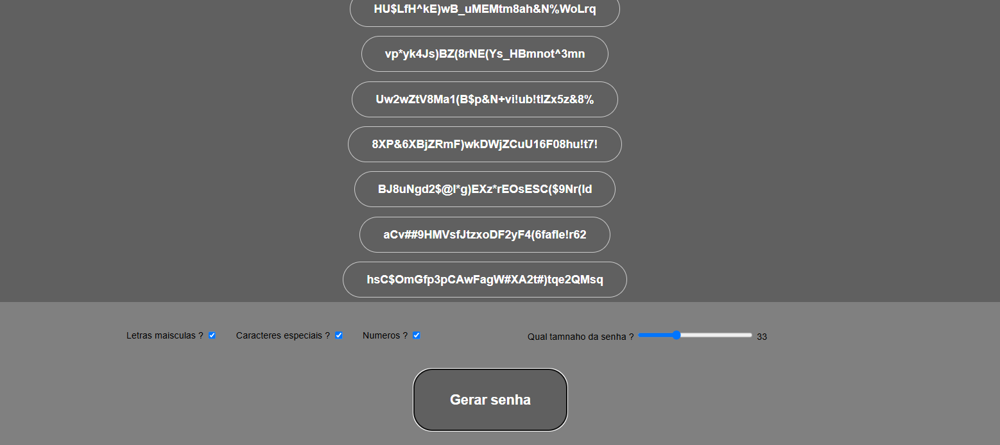

 

# random_password-wepage

> Este é um dos meus projetos para praticar JavaScript, focado na criação de um aplicativo capaz de gerar senhas completamente aleatórias com até 100 dígitos. O aplicativo permite aplicar personalizações para ajustar a criação das senhas conforme necessário.

## Tecnologias

  
  
  

## Contribuir

1. **Clonar projeto:**: `git clone https://github.com/guicarbar/random_password-wepage.git`
2. **Criar feature/branch:**: `git checkout -b feature/Nome-da-branch`

## Licença

Este projeto está sob a licença [MIT](LICENSE) License.